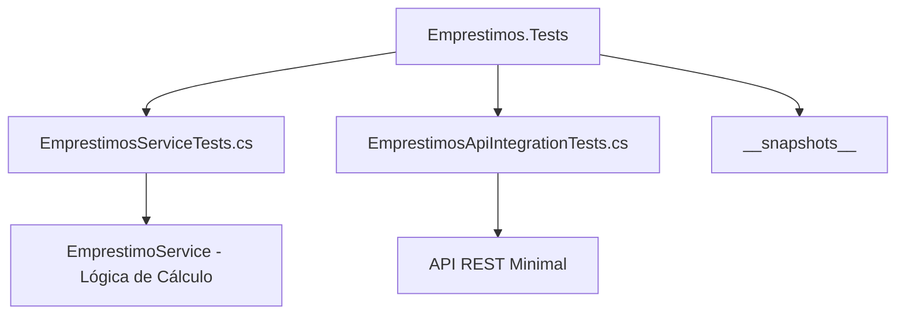
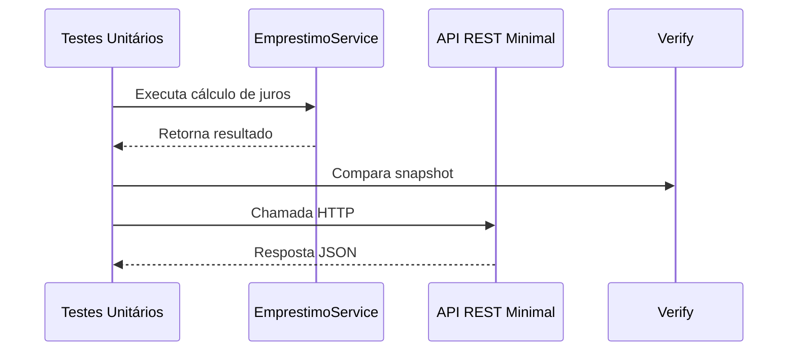

# 📘 API de Empréstimos - Testes Automatizados

> Projeto de **testes unitários e de integração** para a API de Empréstimos, que calcula juros compostos sobre valores solicitados por determinado número de meses.


---

## 📖 Visão Geral

A API calcula o valor total a ser pago com base em:

- **Valor solicitado**
- **Quantidade de meses**
- **Taxa de juros mensal fixa de 1%**

Exemplo de chamada:

```

GET /emprestimo?valor=1000&qtdMeses=6

````

Retorno esperado:

```json
{
  "valorSolicitado": 1000.0,
  "meses": 6,
  "taxaJuros": 0.01,
  "totalPagar": 1061.52
}
````

---

## 🧩 Estrutura do Projeto



**Descrição das pastas:**

* `EmprestimosServiceTests.cs` → Testes **unitários** da lógica de cálculo do serviço `EmprestimoService`.
* `EmprestimosApiIntegrationTests.cs` → Testes **de integração** da API REST.
* `__snapshots__/` → Arquivos de **snapshot** gerados pelo Verify.
* `EmprestimoService` → Serviço que implementa a lógica de juros compostos.
* `API REST Minimal` → Endpoint HTTP exposto para consulta.

---

## 🧪 Tecnologias Utilizadas

* **.NET 8 / Minimal API** — Backend
* **C#** — Linguagem principal
* **xUnit** — Framework de testes
* **FluentAssertions** — Assertivas expressivas
* **Verify** — Snapshot testing

---

## ⚙️ Pré-requisitos

Antes de executar os testes:

* ✅ [.NET 8 SDK](https://dotnet.microsoft.com/en-us/download)
* ✅ IDE: Visual Studio, Rider ou VS Code
* ✅ Aprovação inicial de snapshots do Verify (`.received.txt`)

---

## 🚀 Como Executar os Testes

1. Clone o repositório:

```bash
git clone https://github.com/thiagodsantana/UnitTesting.git
cd UnitTesting
```

2. Execute todos os testes:

```bash
dotnet test
```

> Após rodar os testes com Verify pela primeira vez, aprove os arquivos `.received.txt` como referência (`.verified.txt`).

---

## 📊 Diagrama de Fluxo de Testes



---

## 📂 Organização dos Testes

```
Emprestimos.Tests/
│
├── EmprestimosServiceTests.cs        # Testes unitários da lógica de negócio
├── EmprestimosApiIntegrationTests.cs # Testes de integração da API REST
├── __snapshots__/                    # Arquivos de snapshot do Verify
```

---

## 📈 Boas Práticas Adotadas

* Separação clara entre **testes unitários** e **testes de integração**
* Cobertura de cenários **positivos e negativos**
* Validação de **performance mínima** (<100ms)
* Assertivas expressivas com **FluentAssertions**
* Testes parametrizados com `[Theory]` e `[InlineData]`
* Uso de **snapshot testing** para detectar regressões

---

## 📃 Exemplo de Requisição via cURL

```bash
curl "https://localhost:5001/emprestimo?valor=1000&qtdMeses=6"
```

---

## ✍️ Autor

**Thiago Darlei**
Tests: `xUnit`, `FluentAssertions`, `Verify`
API: `.NET 8`, `Minimal API`

---

## 🛡️ Licença

Licenciado sob a [MIT License](LICENSE).
